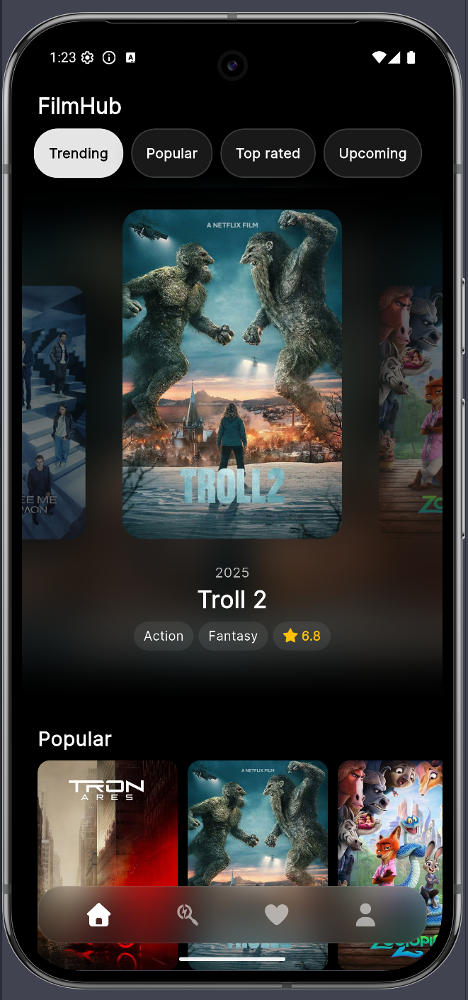
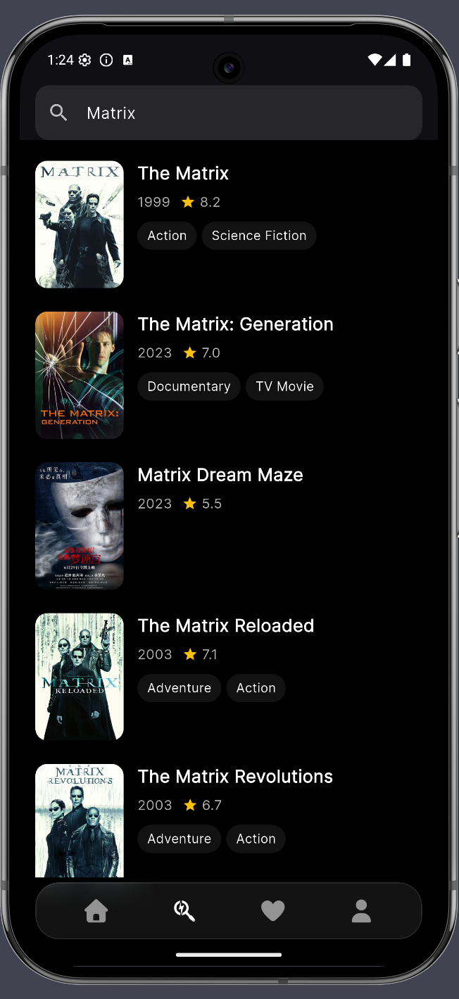
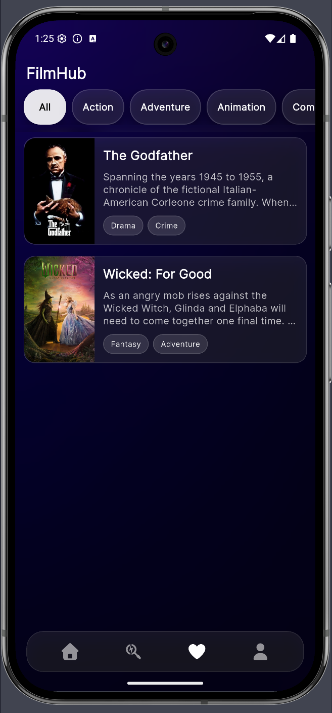
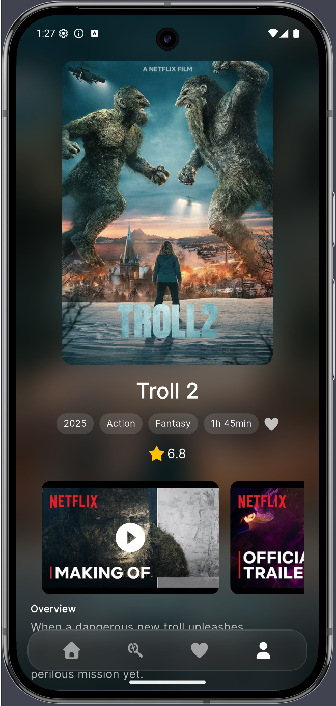
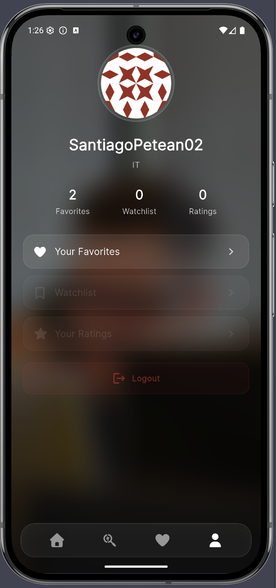

# 🎬 FilmHub App

**FilmHub** is a mobile application built with **Flutter**, designed to let users explore, discover, and save their favorite movies through a fully custom-made, modern, and smooth UI.

The app uses **The Movie Database (TMDB)** API to fetch real-time movie data, featuring polished animations, custom skeleton loaders, and a fully adaptive experience for both Android and iOS.

This app was created with the objective of practicing my skills and releasing it as open-source so anyone interested can collaborate with improvements and optimizations.

---

## 📱 Screenshots

<table>
  <tr>
    <td></td>
    <td></td>
    <td></td>
  </tr>
  <tr>
    <td align="center">Home</td>
    <td align="center">Search</td>
    <td align="center">Favorites</td>
  </tr>
  <tr>
    <td></td>
    <td></td>
  </tr>
  <tr>
    <td align="center">Movie Detail</td>
    <td align="center">User / Profile</td>
  </tr>
</table>

---

## ✨ Features

- 🎥 **Movie Discovery** — Browse the most viewed, popular, upcoming, and top-rated movies.
- 🔍 **Advanced Search** — Quickly find any movie by title or keyword.
- ⭐ **Favorites** — Save your favorite movies for later.
- 🎨 **Fully Custom UI** — Every screen and component is designed from scratch.
- ⚡ **Smooth Animations** — Animated lists, transitions, and custom skeleton loaders.
- 🔗 **TMDB Integration** — Data fetched via the TMDB REST API using `dio`.

---

## 🧩 App Structure

### 🏠 **Home**
- Displays movie sections: most viewed, popular, upcoming, and top-rated.
- Each item includes animations and fully custom skeleton loading states.
- Powered directly by TMDB.

### 🔍 **Search**
- Search for movies in real time.
- Custom-designed list items tailored for the search experience.
- Smooth animations for loading and results.

### ⭐ **Favorites**
- Shows all movies saved by the user.
- Custom skeleton loaders and a consistent visual style across the app.

### 👤 **User / Profile**
- User settings and profile screen.
- Currently **work in progress** — UI only, most actions disabled.

---

## 🔐 Required Setup (API Keys)

FilmHub uses TMDB’s API. To run the app correctly, you must provide your own credentials.

### 1️⃣ Create the following folder:

/assets/env/


### 2️⃣ Inside it, create a file named:


.env


### 3️⃣ Add this content:


TMDB_API_KEY={{apiKey}}

TMDB_BASE_URL=https://api.themoviedb.org/3

IMAGE_BASE_URL=https://image.tmdb.org/t/p

ACCOUNT_ID={{accountId}}


### 4️⃣ Get your `ACCOUNT_ID`
You can obtain it using this API call:


GET https://api.themoviedb.org/3/account


Your API key must be sent as a **Bearer Token**.

### 5️⃣ Example of headers used in the app:

```dart
headers: {
  'Authorization': 'Bearer ${Env.apiKey}',
  'Accept': 'application/json',
}
```

⚠️ Important: without the API key and account ID, the app will not work properly and no movie data will be fetched.
